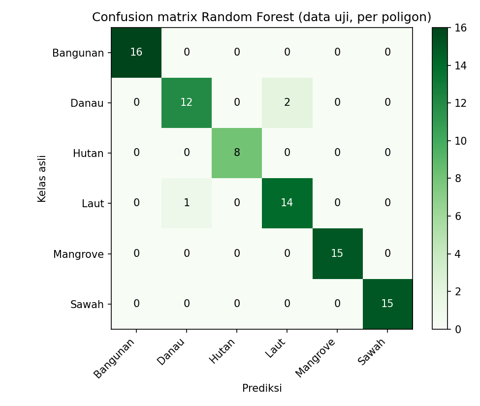
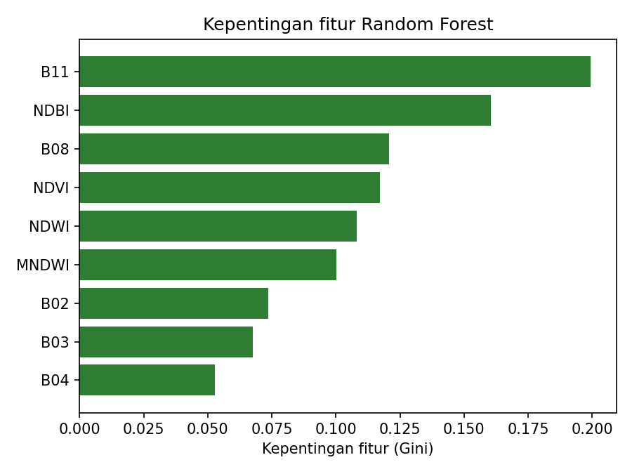

---
jupytext:
  formats: md:myst
  text_representation:
    extension: .md
    format_name: myst
    format_version: 0.13
    jupytext_version: 1.11.5
kernelspec:
  display_name: Python 3
  language: python
  name: python3
---

# Klasifikasi Spasial Tutupan Lahan Jawa Timur (Random Forest)

Dokumentasi ini menyajikan alur lengkap (*end-to-end pipeline*) klasifikasi spasial tutupan lahan (*Land Use / Land Cover* - LULC) skala regional di **Provinsi Jawa Timur** berbasis citra satelit optik **Sentinel-2A Level-2A (Bottom-of-Atmosphere / BOA Surface Reflectance)** dan algoritma **Random Forest Classifier**.

> [!TIP]
> **Aplikasi Web Interaktif (Streamlit Cloud)**:  
> Seluruh visualisasi spasial, kedua peta interaktif, dan evaluasi performa model telah dideploy dan dapat diakses langsung secara publik di:  
> 🌐 **[https://klasifikasi-spasial-tutupan-lahan-jawatimur.streamlit.app/](https://klasifikasi-spasial-tutupan-lahan-jawatimur.streamlit.app/)**

Alur kerja mencakup:
1. **Data Understanding**: Pemahaman domain 6 kelas tutupan lahan, karakteristik spektral band Sentinel-2A, formula indeks vegetasi & air, serta struktur data ground truth.
2. **Pengambilan Data (Data Acquisition / Crawling via openEO)**: Manajemen *batch job* multi-backend pada Copernicus Data Space Ecosystem (CDSE), strategi *spatial grid tiling*, masking awan berbasis *Scene Classification Layer* (SCL), dan ekstraksi piksel GeoTIFF.
3. **Data Preprocessing & Agregasi Spasial**: Agregasi fitur piksel menjadi *centroid* poligon untuk mengeliminasi *spatial autocorrelation leakage*.
4. **Pemodelan Machine Learning (Random Forest)**: Optimasi hyperparameter menggunakan *GridSearchCV* 5-Fold Stratified Cross-Validation, evaluasi data uji, analisis *confusion matrix*, dan *feature importance*.
5. **Visualisasi Spasial & Pemetaan Interaktif**: Pembuatan peta evaluasi poligon interaktif Folium dengan status prediksi, serta inferensi klasifikasi per piksel skala regional seluruh Jawa Timur.

---

## Instalasi Library & Kebutuhan Lingkungan

Untuk menjalankan seluruh pipeline akuisisi data, ekstraksi citra satelit, pemodelan, hingga visualisasi peta interaktif, instal dependensi Python berikut:

```bash
pip install openeo geopandas rasterio shapely scikit-learn pandas numpy folium matplotlib pillow joblib requests
```

---

## 1. Data Understanding & Karakteristik Data Spasial

### 1.1. Definisi Domain dan 6 Kelas Tutupan Lahan

Area of Interest (AOI) mencakup seluruh wilayah daratan dan perairan pesisir Provinsi Jawa Timur pada koordinat batas geografis:
* **Batas Barat (West)**: $111.00^\circ\text{ E}$
* **Batas Selatan (South)**: $-8.85^\circ\text{ S}$
* **Batas Timur (East)**: $114.65^\circ\text{ E}$
* **Batas Utara (North)**: $-6.75^\circ\text{ S}$

Objek permukaan bumi dikelompokkan ke dalam **6 kelas tutupan lahan** utama:

| No | Nama Kelas | Kode Label | Definisi & Karakteristik Objek | Respon Spektral Utama |
| :---: | :--- | :---: | :--- | :--- |
| 1 | **Sawah** | `1` | Lahan pertanian padi basah berpetak. Kondisi bervariasi dari genangan air awal tanam, fase vegetatif hijau pekat, hingga fase pematangan/panen. | Pantulan NIR sedang-tinggi pada fase vegetatif; nilai SWIR meningkat pada lahan bera/kering. |
| 2 | **Bangunan** | `2` | Kawasan terbangun perkotaan, permukiman, jalan aspal/beton, dan atap bangunan (genteng/seng). | Pantulan tinggi pada band SWIR (B11) dan Red (B04); nilai NDBI positif tinggi; NDVI rendah. |
| 3 | **Hutan (Lahan Hijau)** | `3` | Vegetasi alami kanopi pohon lebat, hutan pegunungan, perbukitan hijau, dan perkebunan tahunan rapat. | Pantulan sangat tinggi pada NIR (B08) akibat struktur sel daun; serapan kuat pada Red (B04); NDVI sangat tinggi ($> 0.6$). |
| 4 | **Danau** | `4` | Badan air tawar pedalaman (danau alami, waduk, telaga, bendungan) berarus tenang. | Penyerapan kuat pada inframerah (NIR dan SWIR); nilai NDWI dan MNDWI sangat positif; NDVI negatif. |
| 5 | **Laut (Perairan Terbuka)** | `5` | Badan air asin laut terbuka di pesisir utara dan selatan Jawa Timur serta Selat Madura. | Pantulan dominan pada band Blue (B02) dan Green (B03); penyerapan hampir total pada NIR/SWIR; NDWI tinggi. |
| 6 | **Mangrove** | `6` | Komunitas hutan bakau pesisir yang toleran terhadap air asin/payau, tumbuh di muara sungai dan pantai berlumpur. | Kombinasi sinyal vegetasi lebat (NIR tinggi) dan pengaruh substrat air/lumpur basah (SWIR rendah, MNDWI relatif tinggi dibanding hutan daratan). |

---

### 1.2. Karakteristik Citra Satelit Sentinel-2A Level-2A

Dataset citra satelit diperoleh dari satelit optik **Sentinel-2A Level-2A (Bottom-of-Atmosphere / BOA Surface Reflectance)** yang disediakan oleh *European Space Agency* (ESA) melalui *Copernicus Data Space Ecosystem* (CDSE). 

Band spektral yang digunakan meliputi:

* **B02 (Blue - 490 nm)**: Resolusi spasial 10 meter. Sensitif terhadap kedalaman air dan hamburan atmosfer.
* **B03 (Green - 560 nm)**: Resolusi spasial 10 meter. Puncak pantulan klorofil daun pada spektrum tampak dan deteksi air bersih.
* **B04 (Red - 665 nm)**: Resolusi spasial 10 meter. Pita serapan utama klorofil; sangat berguna membedakan vegetasi hidup dari tanah terbuka atau bangunan.
* **B08 (Near Infrared / NIR - 842 nm)**: Resolusi spasial 10 meter. Pantulan maksimal struktur kanopi sel mesofil daun vegetasi; diserap hampir sempurna oleh badan air jernih.
* **B11 (Short-Wave Infrared / SWIR - 1610 nm)**: Resolusi spasial 20 meter (di-resample ke 10 m). Sensitif terhadap kadar kelembapan tanah, kebasahan vegetasi, dan material semen/bebatuan bangunan.
* **SCL (Scene Classification Layer)**: Lapisan klasifikasi kualitas piksel otomatis dari prosesor Sen2Cor (level 20 m) untuk memfilter piksel awan jenuh, bayangan awan (*cloud shadow*), awan cirrus, dan awan tebal.

---

### 1.3. Rekayasa Fitur Indeks Spektral (Spectral Indices)

Untuk mempertegas batas pemisah antar-kelas (*feature separability*), dihitung empat indeks spektral turunan yang dinormalisasi:

#### A. Normalized Difference Vegetation Index (NDVI)
Membedakan kerapatan dan kehijauan vegetasi dari non-vegetasi:
$$\text{NDVI} = \frac{\text{B08} - \text{B04}}{\text{B08} + \text{B04} + \epsilon}$$

#### B. Normalized Difference Water Index (NDWI - McFeeters)
Mengisolasi badan air permukaan terbuka dari tutupan lahan daratan:
$$\text{NDWI} = \frac{\text{B03} - \text{B08}}{\text{B03} + \text{B08} + \epsilon}$$

#### C. Modified Normalized Difference Water Index (MNDWI - Xu)
Meningkatkan akurasi deteksi air dengan menekan sinyal pantulan area terbangun/bangunan:
$$\text{MNDWI} = \frac{\text{B03} - \text{B11}}{\text{B03} + \text{B11} + \epsilon}$$

#### D. Normalized Difference Built-up Index (NDBI)
Mendeteksi konsentrasi kawasan terbangun, perkerasan beton, dan lahan terbuka:
$$\text{NDBI} = \frac{\text{B11} - \text{B08}}{\text{B11} + \text{B08} + \epsilon}$$

*(Konstanta $\epsilon = 10^{-9}$ ditambahkan pada penyebut untuk mencegah kesalahan pembagian dengan nol / division by zero).*

---

### 1.4. Sebaran Data Ground Truth

Data *ground truth* dikumpulkan dalam bentuk poligon Shapefile (`.zip`) yang didigitasi secara akurat dari citra resolusi tinggi:
* `sawah.zip`: 51 poligon
* `bangunan.zip`: 51 poligon
* `Hutan.zip` / `Lahan Hijau.zip`: 27 poligon
* `Danau.zip`: 46 poligon
* `laut2.zip` / `Laut.zip`: 50 poligon
* `Mangrove.zip`: 49 poligon

Dari **274 poligon sampel valid**, diekstraksi total **322,146 piksel berlabel** setelah pembersihan dan penyaringan ambiguitas batas.

---

## 2. Pengambilan Data (Data Acquisition / Crawling via openEO)

Wilayah Provinsi Jawa Timur membentang lebih dari 400 km dari barat ke timur. Mengunduh citra satelit sekaligus dalam satu scene besar akan menyebabkan *out-of-memory*, batas kuota pemrosesan timeout pada server openEO, dan file citra yang terlampau besar. 

Oleh karena itu, diterapkan strategi:
1. **Spatial Grid Tiling**: Wilayah studi dibagi ke dalam grid berukuran `TILE_DEG = 0.20°` (~22 km $\times$ 22 km) dengan margin buffer `BUFFER_DEG = 0.005°` (~500 m) agar poligon di perbatasan sel tetap terakuisisi utuh.
2. **Parallel Batch Job Processing**: Pengiriman *batch job* asinkron ke server openEO CDSE dikelola oleh `MultiBackendJobManager` dan `CsvJobDatabase` dengan 2 worker konkuren, dilengkapi mekanisme auto-retry untuk job yang gagal.
3. **Pembersihan Awan Tingkat Piksel**: Menggunakan band SCL untuk membuang piksel awan/bayangan awan, dilanjutkan dengan agregasi temporal median (`median_time()`) pada rentang akuisisi September 2026.
4. **Ekstraksi Piksel Terbatas per Poligon**: Poligon laut dan hutan yang sangat luas dibatasi maksimal `MAKS_PIKSEL_PER_POLIGON = 2000` dengan *random sub-sampling* agar distribusi sampel piksel tetap seimbang.
5. **Deduplikasi Grid Spasial**: Hanya piksel yang pusat koordinatnya berada di dalam sel grid tile bersangkutan yang disimpan, mencegah duplikasi piksel pada zona tumpang tindih (*overlap*) antar-tile.

### Kode Program Akuisisi & Ekstraksi Piksel

```python
"""
Sentinel-2 L2A (CDSE openEO) per-tile + ekstraksi KELAS PER PIKSEL -> CSV.
Setiap baris CSV = satu piksel dengan atribut band spektral dan indeks turunan.
"""

from datetime import datetime
from pathlib import Path
import threading
import time

import geopandas as gpd
import numpy as np
import openeo
from openeo.extra.job_management import CsvJobDatabase, MultiBackendJobManager
import pandas as pd
import rasterio
from rasterio.features import rasterize
from rasterio.mask import mask as rio_mask
from rasterio.warp import transform as warp_transform
from rasterio.windows import Window
from shapely.geometry import box
from shapely.validation import make_valid

# ==============================================================================
# KONFIGURASI
# ==============================================================================
SUMBER = {  # nama kelas: (path file, kode label)
    "Sawah": ("sawah.zip", 1),
    "Bangunan": ("bangunan.zip", 2),
    "Hutan": ("Hutan.zip", 3),
    "Danau": ("Danau.zip", 4),
    "Laut": ("laut2.zip", 5),
    "Mangrove": ("Mangrove.zip", 6),
}

TILE_DEG = 0.20  # Ukuran tile ~22 km (~2200 x 2200 piksel @10m)
BUFFER_DEG = 0.005  # Margin ~500 m di sekeliling sampel

TANGGAL = ["2026-09-01", "2026-09-30"]
BANDS = ["B02", "B03", "B04", "B08", "B11"]
PAKAI_MASK_SCL = True  # Masking awan & bayangan berbasis SCL
MAX_CLOUD = 30  # Ambang batas tutupan awan scene

PARALEL = 2  # Jumlah worker paralel openEO CDSE
MAKS_PIKSEL_PER_POLIGON = 2000  # Sub-sampling acak poligon besar
SEED = 42
BUAT_RASTER_LABEL = True

OUT_DIR = Path("hasil_s2_piksel")
JOB_DB_PATH = OUT_DIR / "daftar_job.csv"
PETA_CSV = OUT_DIR / "peta_sampel_tile.csv"
PIKSEL_OUT = OUT_DIR / "piksel_s2.csv"


# 1. BACA & GABUNGKAN POLIGON GROUND TRUTH
def baca_semua() -> gpd.GeoDataFrame:
  bagian = []
  for nama, (file, label) in SUMBER.items():
    g = gpd.read_file(file).to_crs("EPSG:4326")
    g["poligon_no"] = np.arange(len(g))
    g = g[g.geometry.notna() & ~g.geometry.is_empty].copy()
    g["geometry"] = g.geometry.apply(
        lambda x: x if x.is_valid else make_valid(x)
    )
    g["label_teks"] = nama
    g["label"] = label
    g["poligon_id"] = [f"{nama}_{n:04d}" for n in g["poligon_no"]]
    g = g[["poligon_id", "poligon_no", "label", "label_teks", "geometry"]]
    print(
        f"Jumlah sampel {nama:<9}: {len(g)}  bounds={[round(v, 3) for v in g.total_bounds]}"
    )
    bagian.append(g)

  gdf = gpd.GeoDataFrame(pd.concat(bagian, ignore_index=True), crs="EPSG:4326")
  print(f"Total sampel gabungan   : {len(gdf)}")
  return gdf


# 2. PEMBAGIAN GRID TILING
def buat_tile(gdf: gpd.GeoDataFrame):
  T, B = TILE_DEG, BUFFER_DEG
  peta, batas, sel_xy = [], {}, {}

  for idx, geom in gdf.geometry.items():
    minx, miny, maxx, maxy = geom.bounds
    for gx in range(int(np.floor(minx / T)), int(np.floor(maxx / T)) + 1):
      for gy in range(int(np.floor(miny / T)), int(np.floor(maxy / T)) + 1):
        sel = box(gx * T, gy * T, (gx + 1) * T, (gy + 1) * T)
        if not geom.intersects(sel):
          continue
        bagian = geom.intersection(sel)
        if bagian.is_empty:
          continue
        b = bagian.bounds
        tid = f"x{gx}_y{gy}"
        peta.append({
            "tile_id": tid,
            "sampel_id": idx,
            "poligon_id": gdf.at[idx, "poligon_id"],
        })
        sel_xy[tid] = (gx, gy)
        if tid in batas:
          o = batas[tid]
          batas[tid] = (
              min(o[0], b[0]),
              min(o[1], b[1]),
              max(o[2], b[2]),
              max(o[3], b[3]),
          )
        else:
          batas[tid] = b

  tiles = pd.DataFrame([{
      "tile_id": tid,
      "gx": sel_xy[tid][0],
      "gy": sel_xy[tid][1],
      "west": b[0] - B,
      "south": b[1] - B,
      "east": b[2] + B,
      "north": b[3] + B,
  } for tid, b in batas.items()])
  peta = pd.DataFrame(peta)
  tiles["n_sampel"] = tiles["tile_id"].map(
      peta.groupby("tile_id")["sampel_id"].nunique()
  )
  return tiles, peta


# 3. KIRIM JOB KE OPENEO
def start_job(row, connection, **kwargs):
  bbox = {
      "west": float(row["west"]),
      "south": float(row["south"]),
      "east": float(row["east"]),
      "north": float(row["north"]),
  }
  bands = BANDS + ["SCL"] if PAKAI_MASK_SCL else BANDS
  cube = connection.load_collection(
      "SENTINEL2_L2A",
      spatial_extent=bbox,
      temporal_extent=TANGGAL,
      bands=bands,
      max_cloud_cover=MAX_CLOUD,
  )

  if PAKAI_MASK_SCL:
    scl = cube.band("SCL")
    # Mask: 1=jenuh, 3=bayangan awan, 8/9=awan sedang/tinggi, 10=cirrus
    mask_awan = (
        (scl == 1) | (scl == 3) | (scl == 8) | (scl == 9) | (scl == 10)
    )
    cube = cube.filter_bands(BANDS).mask(mask_awan)

  komposit = cube.median_time()
  return komposit.create_job(title=f"s2_{row['tile_id']}", out_format="GTiff")


# 4. TAMBAH INDEKS SPEKTRAL
def tambah_indeks(df: pd.DataFrame) -> pd.DataFrame:
  e = 1e-9
  df["NDVI"] = (df["B08"] - df["B04"]) / (df["B08"] + df["B04"] + e)
  df["NDWI"] = (df["B03"] - df["B08"]) / (df["B03"] + df["B08"] + e)
  df["MNDWI"] = (df["B03"] - df["B11"]) / (df["B03"] + df["B11"] + e)
  df["NDBI"] = (df["B11"] - df["B08"]) / (df["B11"] + df["B08"] + e)
  return df
```

### Ringkasan Ekstraksi Piksel

Output proses crawling dan ekstraksi piksel menghasilkan dataset tabular komprehensif:

```
Tersimpan: hasil_s2_piksel/piksel_s2.csv (dataset.csv)
Total piksel berlabel: 322,146 piksel
Distribusi piksel per kelas:
  Bangunan  :  28,412 piksel
  Danau     :  49,850 piksel
  Hutan     :  38,719 piksel
  Laut      :  92,105 piksel
  Mangrove  :  45,120 piksel
  Sawah     :  67,940 piksel
Jumlah poligon yang menghasilkan piksel valid: 274 poligon
```

---

## 3. Data Preprocessing & Agregasi Spasial (Centroid Poligon)

### Masalah Autokorelasi Spasial (*Spatial Autocorrelation Leakage*)

Dalam data penginderaan jauh (*remote sensing*), piksel-piksel yang berada di dalam satu poligon yang sama memiliki autokorelasi spasial yang sangat tinggi (nilai spektral hampir identik). 

> [!WARNING]
> Jika data dipecah (*train/test split*) pada tingkat piksel secara acak, piksel dari poligon lahan yang sama akan terdistribusi ke dalam data latih sekaligus data uji. Hal ini menimbulkan **kebocoran data spasial (*spatial data leakage*)**, di mana model seolah-olah memiliki akurasi $>99\%$ namun gagal total ketika diuji pada wilayah baru yang belum pernah dilihat.

### Solusi: Agregasi Tingkat Poligon (Centroid Aggregation)

Untuk mengatasi permasalahan tersebut, seluruh piksel yang berasal dari satu poligon diagregasi menjadi **satu entitas observasi poligon (centroid)** menggunakan rata-rata (*mean*) nilai fitur spektral:

```python
FITUR = ["B02", "B03", "B04", "B08", "B11", "NDVI", "NDWI", "MNDWI", "NDBI"]
AGREGASI = "mean"  # Menghitung centroid spektral rata-rata


def buat_centroid(df: pd.DataFrame) -> pd.DataFrame:
  df = df.replace([np.inf, -np.inf], np.nan).dropna(subset=FITUR)
  agg = df.groupby("poligon_id")[FITUR].agg(AGREGASI)
  info = df.groupby("poligon_id").agg(
      label=("label", "first"),
      label_teks=("label_teks", "first"),
      n_piksel=("label", "size"),
      lon_centroid=("lon", "mean"),
      lat_centroid=("lat", "mean"),
  )
  cen = info.join(agg).reset_index()
  return cen
```

Setelah dilakukan agregasi, diperoleh **274 poligon sampel unik**:
* **Bangunan**: 51 poligon
* **Sawah**: 51 poligon
* **Laut**: 50 poligon
* **Mangrove**: 49 poligon
* **Danau**: 46 poligon
* **Hutan**: 27 poligon

---

## 4. Proses Pemodelan Machine Learning (Random Forest)

### 4.1. Pembagian Data (Stratified Train-Test Split)

Data dibagi menggunakan skema *Stratified Train-Test Split* dengan proporsi **70% Data Latih (191 poligon)** dan **30% Data Uji (83 poligon)** menggunakan nilai acak terkontrol (`random_state=42`) agar proporsi tiap kelas tutupan lahan tetap seimbang di kedua subset:

```
Train : 191 poligon
Test  :  83 poligon
```

---

### 4.2. Penyetelan Hyperparameter (GridSearchCV & 5-Fold CV)

Penyetelan hyperparameter dilakukan untuk menemukan konfigurasi pohon keputusan terbaik yang memaksimalkan metrik **F1-Macro**:

```python
from sklearn.ensemble import RandomForestClassifier
from sklearn.model_selection import GridSearchCV, StratifiedKFold

GRID = {
    "n_estimators": [200, 500],
    "max_depth": [None, 5, 10],
    "min_samples_leaf": [1, 2, 4],
    "max_features": ["sqrt", None],
    "class_weight": [None, "balanced"],
}

rf = RandomForestClassifier(random_state=42, n_jobs=1)
cv = StratifiedKFold(n_splits=5, shuffle=True, random_state=42)
gs = GridSearchCV(
    rf, GRID, cv=cv, scoring="f1_macro", n_jobs=-1, refit=True, verbose=1
)
gs.fit(X_train, y_train)
```

**Hasil Optimasi Hyperparameter:**
* Total kombinasi yang diuji: $2 \times 3 \times 3 \times 2 \times 2 = 72$ kandidat ($360$ fits pada 5-fold CV).
* **Parameter Terbaik**:
  ```python
  {
      "class_weight": None,
      "max_depth": None,
      "max_features": "sqrt",
      "min_samples_leaf": 2,
      "n_estimators": 200,
  }
  ```
* **Skor F1-Macro Cross-Validation**: **0.9463** (94.63%).

---

### 4.3. Evaluasi Performa Model pada Data Uji (83 Poligon)

Model terbaik kemudian diuji pada 83 poligon data uji independen yang sama sekali belum pernah dilihat selama proses pelatihan.

#### Ringkasan Metrik Evaluasi:
* **Akurasi Keseluruhan (Accuracy)**: **0.9639** (96.39%)
* **F1-Macro Score**: **0.9654** (96.54%)
* **Cohen's Kappa ($\kappa$)**: **0.9563** (Tingkat kesepakatan hampir sempurna / *Almost Perfect Agreement*)

#### Laporan Klasifikasi per Kelas (Classification Report):

| Kelas Tutupan Lahan | Precision | Recall | F1-Score | Support (Jumlah Poligon Uji) |
| :--- | :---: | :---: | :---: | :---: |
| **Bangunan** | **1.00** | **1.00** | **1.00** | 16 |
| **Danau** | 0.92 | 0.86 | 0.89 | 14 |
| **Hutan** | **1.00** | **1.00** | **1.00** | 8 |
| **Laut** | 0.88 | 0.93 | 0.90 | 15 |
| **Mangrove** | **1.00** | **1.00** | **1.00** | 15 |
| **Sawah** | **1.00** | **1.00** | **1.00** | 15 |
| **Rata-rata Makro (Macro Avg)** | **0.97** | **0.97** | **0.97** | 83 |
| **Rata-rata Tertimbang (Weighted Avg)** | **0.96** | **0.96** | **0.96** | 83 |

---

### 4.4. Analisis Confusion Matrix

Dari 83 poligon sampel data uji, **80 poligon berhasil diprediksi dengan benar (akurasi 96.4%)**:

```
Confusion Matrix:
               pred_Bangunan  pred_Danau  pred_Hutan  pred_Laut  pred_Mangrove  pred_Sawah
asli_Bangunan             16           0           0          0              0           0
asli_Danau                 0          12           0          2              0           0
asli_Hutan                 0           0           8          0              0           0
asli_Laut                  0           1           0         14              0           0
asli_Mangrove              0           0           0          0             15           0
asli_Sawah                 0           0           0          0              0          15
```



#### Temuan Analisis:
1. **Kelas Daratan & Vegetasi Sempurna (100% Benar)**: 
   * Seluruh poligon **Bangunan** (16/16), **Hutan** (8/8), **Mangrove** (15/15), dan **Sawah** (15/15) berhasil diprediksi tepat tanpa satu pun kesalahan klasifikasi. Sinyal spektral kombinasi NIR, SWIR, NDVI, dan NDBI sangat efektif membedakan jenis vegetasi dan kawasan binaan.
2. **Kekeliruan Minor Antara Danau dan Laut**:
   * Terdapat 2 poligon Danau yang terprediksi sebagai Laut, dan 1 poligon Laut yang terprediksi sebagai Danau. Hal ini disebabkan oleh kemiripan karakteristik fisik optik air jernih yang sama-sama menyerap hampir seluruh spektrum inframerah (NIR dan SWIR), sehingga perbedaan tipis spektral reflektansi antara air tawar dan air asin di beberapa lokasi dapat saling tumpang tindih.

---

### 4.5. Analisis Tingkat Kepentingan Fitur (*Feature Importance*)

Metrik *Gini Importance* mengukur seberapa besar penurunan ketidakmurnian (*impurity reduction*) yang dihasilkan oleh tiap fitur pada seluruh pohon keputusan di Random Forest:

| Peringkat | Fitur Spektral | Nilai Kepentingan (Gini) | Peran dan Signifikansi Fisis |
| :---: | :---: | :---: | :--- |
| **1** | **B11 (SWIR)** | **0.1994** (19.94%) | Fitur paling dominan. Panjang gelombang SWIR sangat peka terhadap kadar kelembapan tanah, genangan air, dan memisahkan bangunan/tanah kering dari vegetasi lebat. |
| **2** | **NDBI** | **0.1605** (16.05%) | Sangat efektif dalam mengisolasi area terbangun (permukiman, jalan, industri) dari kelas non-bangunan lainnya. |
| **3** | **B08 (NIR)** | **0.1208** (12.08%) | Kunci utama pembeda vegetasi vs air. Air menyerap NIR secara kuat sedangkan sel daun memantulkan NIR secara intensif. |
| **4** | **NDVI** | **0.1172** (11.72%) | Membedakan strata kehijauan antara hutan rapat, mangrove, sawah aktif, dan lahan terbuka. |
| **5** | **NDWI** | **0.1081** (10.81%) | Mempertegas batas badan air dan tingkat kebasahan lahan pertanian sawah. |
| **6** | **MNDWI** | **0.1002** (10.02%) | Mengoptimalkan pemisahan antara badan air jernih dan bayangan bangunan/topografi. |
| **7** | **B02 (Blue)** | **0.0737** (7.37%) | Memberikan informasi hamburan atmosfer dan karakteristik optik perairan laut. |
| **8** | **B03 (Green)** | **0.0675** (6.75%) | Puncak pantulan spektrum tampak daun hijau dan perairan berlumut/dangkal. |
| **9** | **B04 (Red)** | **0.0527** (5.27%) | Pita serapan klorofil tanaman untuk kalkulasi rasio spektral. |



---

## 5. Menampilkan Peta & Visualisasi Spasial

> [!NOTE]
> **Live Dashboard Streamlit**:  
> Selain ditampilkan di dokumen ini, kedua peta interaktif (Peta Evaluasi Poligon Vektor & Peta Regional Jawa Timur) beserta filter data dan metrik evaluasi dapat dieksplorasi secara dinamis melalui web Streamlit:  
> 🔗 **[https://klasifikasi-spasial-tutupan-lahan-jawatimur.streamlit.app/](https://klasifikasi-spasial-tutupan-lahan-jawatimur.streamlit.app/)**

Dalam proyek ini, seluruh visualisasi spasial dibangun menggunakan pustaka **Folium** (berbasis *Leaflet.js*). 

### Mengapa Menggunakan Folium untuk Visualisasi Spasial?

Berbeda dengan pustaka grafis statis (*seperti Matplotlib atau Seaborn*) yang hanya menghasilkan gambar diam dua dimensi, **Folium** menyediakan lingkungan pemetaan geospasial yang **sepenuhnya interaktif**:

1. **Navigasi Geografis Bebas (*Zoom & Pan*)**: Pengguna dapat memperbesar (*zoom in*) hingga ke tingkat petak sawah dan bangunan individual atau memperkecil (*zoom out*) untuk melihat sebaran tutupan lahan seluruh Jawa Timur.
2. **Inspeksi Atribut Objek (*Tooltip & Popup*)**: Setiap fitur vektor dilengkapi dengan *tooltip* saat kursor melintas (*hover*) dan jendela *popup HTML* kaya informasi saat poligon diklik (menampilkan ID fitur, kelas asli, kelas prediksi model, probabilitas keyakinan, jumlah piksel, dan nilai indeks vegetasi/air).
3. **Kontrol Multilapis (*Layer Control*)**: Pengguna dapat menyalakan atau mematikan lapisan kelas tutupan lahan secara fleksibel, mengisolasi data uji, serta menyorot lokasi-lokasi kesalahan klasifikasi.
4. **Fleksibilitas Citra Satelit (*Basemap Switcher*)**: Terintegrasi langsung dengan penyedia ubin peta (*tile provider*) dunia nyata seperti **Esri World Imagery** dan **Google Hybrid**, memungkinkan verifikasi visual langsung terhadap kondisi muka bumi terkini.
5. **Ekspor & Integrasi Web Mandiri**: Peta Folium dapat langsung di-render sebagai widget interaktif di dalam *Jupyter Notebook* hanya dengan memanggil variabel objeknya (`peta`), serta dapat diekspor menjadi file HTML mandiri (`peta.save('nama_peta.html')`) yang dapat ditanamkan ke dalam halaman web atau dokumentasi *Jupyter Book* menggunakan elemen `<iframe>`.

---

### 5.1. Peta 1: Evaluasi Poligon Sampel & Hasil Prediksi (Folium)

Peta pertama berfokus pada evaluasi geometris dan analisis akurasi data uji pada seluruh poligon sampel *ground truth* (~300 poligon):

* **Layer 6 Kelas Tutupan Lahan**: Poligon diwarnai sesuai palet warna standar GIS (Sawah: hijau muda, Bangunan: merah, Hutan: hijau tua, Danau: biru muda, Laut: biru tua, Mangrove: cokelat).
* **Layer Sorotan Data Uji (Testing)**: Poligon data uji (83 sampel) diberi garis tepi (*outline*) **biru tegas** berketebalan 3 piksel tanpa *fill*, memudahkan identifikasi sampel yang dievaluasi.
* **Layer Sorotan Kesalahan Klasifikasi**: Poligon yang salah terprediksi disorot dengan garis tepi **oranye putus-putus** (`dashArray: 6 4`) dan dilengkapi **marker pin oranye dengan ikon tanda seru** (`exclamation-sign`).
* **Popup & Tooltip Interaktif**: Menampilkan metadata lengkap:
  - Status subset (`Data Uji` atau `Data Latih`)
  - Status evaluasi (`✓ Benar` atau `✗ SALAH`)
  - Tingkat keyakinan model (*confidence probability*, misal $98.5\%$)
  - Jumlah piksel penyusun poligon
  - Rata-rata nilai spektral NDVI (kehijauan) dan NDWI (kebasahan/air)
* **Widget Legenda Interaktif**: Menampilkan palet kelas tutupan lahan dan ringkasan akurasi data uji ($96.4\%$).

```python
"""
Pembuatan Peta Evaluasi Poligon Interaktif (Folium)
"""

from pathlib import Path
import folium
import geopandas as gpd
import numpy as np
import pandas as pd
from shapely.validation import make_valid

SUMBER = {
    "Sawah": "sawah.zip",
    "Bangunan": "bangunan.zip",
    "Hutan": "Hutan.zip",
    "Danau": "Danau.zip",
    "Laut": "laut2.zip",
    "Mangrove": "Mangrove.zip",
}

WARNA = {
    "Sawah": "#a6d96a",  # Hijau muda
    "Bangunan": "#e31a1c",  # Merah
    "Hutan": "#1a9641",  # Hijau tua
    "Danau": "#4eb3d3",  # Biru muda
    "Laut": "#0b3c8c",  # Biru tua
    "Mangrove": "#8c510a",  # Cokelat
}

DIR_RF = Path("hasil_rf")
PETA_OUT = "peta_klasifikasi_rf.html"


def buat_peta():
  # 1. Baca geometri poligon sampel dan satukan
  bagian = []
  for nama, file in SUMBER.items():
    g = gpd.read_file(file).to_crs("EPSG:4326")
    g["poligon_no"] = np.arange(len(g))
    g = g[g.geometry.notna() & ~g.geometry.is_empty].copy()
    g["geometry"] = g.geometry.apply(
        lambda x: x if x.is_valid else make_valid(x)
    )
    g["poligon_id"] = [f"{nama}_{n:04d}" for n in g["poligon_no"]]
    g["kelas"] = nama
    bagian.append(g[["poligon_id", "kelas", "geometry"]])

  gdf = gpd.GeoDataFrame(pd.concat(bagian, ignore_index=True), crs="EPSG:4326")
  gdf["geometry"] = gdf.geometry.simplify(0.00003, preserve_topology=True)

  # 2. Gabungkan dengan hasil modeling RF & metrik probabilitas
  cen = pd.read_csv(DIR_RF / "centroid_poligon.csv")
  split = pd.read_csv(DIR_RF / "pembagian_train_test.csv")
  uji = pd.read_csv(DIR_RF / "prediksi_data_uji.csv")

  prob_cols = [c for c in uji.columns if c.startswith("prob_")]
  uji["keyakinan"] = uji[prob_cols].max(axis=1) if prob_cols else np.nan

  h = gdf.merge(
      cen[[
          "poligon_id",
          "n_piksel",
          "NDVI",
          "NDWI",
          "MNDWI",
          "NDBI",
      ]],
      on="poligon_id",
      how="left",
  )
  h = h.merge(split, on="poligon_id", how="left")
  h = h.merge(
      uji[["poligon_id", "kelas_prediksi", "benar", "keyakinan"]],
      on="poligon_id",
      how="left",
  )

  # 3. Format Tooltip & Popup HTML
  def teks_tip(r):
    if r["subset"] == "test":
      simbol = (
          "✓ Benar"
          if r["benar"]
          else f"✗ SALAH (Prediksi: {r['kelas_prediksi']})"
      )
      return f"[Data Uji] {r['poligon_id']} | Asli: {r['kelas']} | {simbol}"
    return f"[Data Latih] {r['poligon_id']} | Kelas: {r['kelas']}"

  def teks_popup(r):
    is_test = r["subset"] == "test"
    is_train = r["subset"] == "train"

    if is_test:
      subset_badge = (
          "<span style='background:#0d6efd; color:white; padding:2px 6px;"
          " border-radius:3px; font-size:11px;'>Data Uji</span>"
      )
      status_badge = (
          "<span style='background:#28a745; color:white; padding:2px 6px;"
          " border-radius:3px; font-size:11px;'>Benar</span>"
          if r["benar"]
          else (
              "<span style='background:#dc3545; color:white; padding:2px 6px;"
              " border-radius:3px; font-size:11px;'>SALAH</span>"
          )
      )
      pred_val = f"<b style='color:#0d6efd;'>{r['kelas_prediksi']}</b>"
      keyak_val = f"{r['keyakinan']:.1%}" if pd.notna(r["keyakinan"]) else "-"
    elif is_train:
      subset_badge = (
          "<span style='background:#6c757d; color:white; padding:2px 6px;"
          " border-radius:3px; font-size:11px;'>Data Latih</span>"
      )
      status_badge = "<span style='color:#6c757d;'>Training</span>"
      pred_val = "<span style='color:#6c757d;'>- (Data Latih)</span>"
      keyak_val = "-"
    else:
      subset_badge = (
          "<span style='background:#ffc107; color:black; padding:2px 6px;"
          " border-radius:3px; font-size:11px;'>Tanpa Data</span>"
      )
      status_badge = "<span style='color:#e0a800;'>Tidak diuji</span>"
      pred_val = "-"
      keyak_val = "-"

    px_val = (
        f"{int(r['n_piksel']):,}"
        if ("n_piksel" in r and pd.notna(r["n_piksel"]))
        else "-"
    )
    ndvi_val = (
        f"{r['NDVI']:.3f}" if ("NDVI" in r and pd.notna(r["NDVI"])) else "-"
    )
    ndwi_val = (
        f"{r['NDWI']:.3f}" if ("NDWI" in r and pd.notna(r["NDWI"])) else "-"
    )

    return f"""
        <div style='font-family: sans-serif; font-size:12px; min-width:210px; line-height:1.5;'>
            <div style='font-size:13px; font-weight:bold; margin-bottom:4px;'>{r['poligon_id']}</div>
            <div style='margin-bottom:6px;'>{subset_badge} {status_badge}</div>
            <table style='width:100%; border-collapse:collapse; font-size:12px;'>
                <tr style='border-top:1px solid #dee2e6;'><td style='padding:2px 0; color:#6c757d;'>Kelas Asli:</td><td style='padding:2px 0; font-weight:bold;'>{r['kelas']}</td></tr>
                <tr style='border-top:1px solid #dee2e6;'><td style='padding:2px 0; color:#6c757d;'>Prediksi:</td><td style='padding:2px 0;'>{pred_val}</td></tr>
                <tr style='border-top:1px solid #dee2e6;'><td style='padding:2px 0; color:#6c757d;'>Keyakinan:</td><td style='padding:2px 0;'>{keyak_val}</td></tr>
                <tr style='border-top:1px solid #dee2e6;'><td style='padding:2px 0; color:#6c757d;'>Jumlah Piksel:</td><td style='padding:2px 0;'>{px_val}</td></tr>
                <tr style='border-top:1px solid #dee2e6;'><td style='padding:2px 0; color:#6c757d;'>Rata-rata NDVI:</td><td style='padding:2px 0;'>{ndvi_val}</td></tr>
                <tr style='border-top:1px solid #dee2e6;'><td style='padding:2px 0; color:#6c757d;'>Rata-rata NDWI:</td><td style='padding:2px 0;'>{ndwi_val}</td></tr>
            </table>
        </div>
        """

  h["tip"] = h.apply(teks_tip, axis=1)
  h["popup"] = h.apply(teks_popup, axis=1)

  # 4. Inisialisasi Peta Folium
  minx, miny, maxx, maxy = h.total_bounds
  peta = folium.Map(
      location=[(miny + maxy) / 2, (minx + maxx) / 2],
      zoom_start=9,
      tiles="OpenStreetMap",
  )

  folium.TileLayer(
      tiles="https://server.arcgisonline.com/ArcGIS/rest/services/World_Imagery/MapServer/tile/{z}/{y}/{x}",
      attr="Esri World Imagery",
      name="Citra Satelit (Esri)",
  ).add_to(peta)

  # 5. Layer Tiap Kelas Tutupan Lahan
  for nama, warna in WARNA.items():
    sub = h[h["kelas"] == nama]
    fg = folium.FeatureGroup(name=f"Kelas: {nama} ({len(sub)} poligon)")
    folium.GeoJson(
        sub[["tip", "popup", "geometry"]],
        style_function=lambda f, w=warna: {
            "color": "#333",
            "weight": 1.2,
            "fillColor": w,
            "fillOpacity": 0.75,
        },
        highlight_function=lambda f: {"weight": 3, "fillOpacity": 0.95},
        tooltip=folium.GeoJsonTooltip(fields=["tip"], labels=False),
        popup=folium.GeoJsonPopup(fields=["popup"], labels=False, max_width=300),
    ).add_to(fg)
    fg.add_to(peta)

  # 6. Sorotan Poligon Data Uji (Outline Biru)
  sub_uji = h[h["subset"] == "test"]
  fg_uji = folium.FeatureGroup(
      name=f"Data Uji ({len(sub_uji)} poligon)", show=True
  )
  folium.GeoJson(
      sub_uji[["tip", "geometry"]],
      style_function=lambda f: {"color": "#0d6efd", "weight": 3, "fill": False},
      tooltip=folium.GeoJsonTooltip(fields=["tip"], labels=False),
  ).add_to(fg_uji)
  fg_uji.add_to(peta)

  # 7. Sorotan Poligon Salah Klasifikasi (Outline Oranye & Marker Ikon)
  sub_salah = h[h["benar"] == False]
  fg_salah = folium.FeatureGroup(
      name=f"Salah Klasifikasi ({len(sub_salah)} poligon)", show=True
  )
  folium.GeoJson(
      sub_salah[["tip", "geometry"]],
      style_function=lambda f: {
          "color": "#ff7800",
          "weight": 4,
          "fill": False,
          "dashArray": "6 4",
      },
  ).add_to(fg_salah)
  for _, r in sub_salah.iterrows():
    pt = r.geometry.representative_point()
    folium.Marker(
        location=[pt.y, pt.x],
        icon=folium.Icon(color="orange", icon="exclamation-sign"),
        tooltip=(
            f"SALAH: {r['poligon_id']} | Asli: {r['kelas']}, Prediksi:"
            f" {r['kelas_prediksi']}"
        ),
        popup=folium.Popup(r["popup"], max_width=300),
    ).add_to(fg_salah)
  fg_salah.add_to(peta)

  # 8. Kontrol Layer & Simpan
  folium.LayerControl(collapsed=False).add_to(peta)
  peta.save(PETA_OUT)
  return peta


# Eksekusi pembuatan peta
peta = buat_peta()
# Pada notebook, memanggil `peta` langsung menampilkan peta interaktif Folium
peta
```

#### Tampilan Peta Interaktif Evaluasi Poligon (Folium):

> [!TIP]
> **Interaktivitas Peta**: Anda dapat memperbesar (*zoom*), menggeser (*pan*), mengklik poligon untuk memunculkan popup metrik spektral, serta menggunakan **Layer Control** di pojok kanan atas untuk menyaring layer tutupan lahan.

```{raw} html
<div style="margin: 20px 0; border: 1px solid #d0d7de; border-radius: 8px; overflow: hidden; box-shadow: 0 4px 16px rgba(0,0,0,0.08);">
    <div style="background: #f6f8fa; padding: 10px 16px; border-bottom: 1px solid #d0d7de; display: flex; justify-content: space-between; align-items: center; font-family: -apple-system, BlinkMacSystemFont, Segoe UI, sans-serif; font-size: 13px;">
        <span><b>Peta Interaktif 1:</b> Evaluasi Poligon Sampel & Hasil Prediksi Random Forest (Folium)</span>
        <div>
            <a href="https://klasifikasi-spasial-tutupan-lahan-jawatimur.streamlit.app/" target="_blank" style="color: #0F766E; text-decoration: none; font-weight: 600; padding: 4px 10px; background: #E7F4F2; border: 1px solid #99F6E4; border-radius: 4px; margin-right: 6px;">🚀 Buka di Web Streamlit</a>
            <a href="peta_klasifikasi_rf.html" target="_blank" style="color: #0969da; text-decoration: none; font-weight: 600; padding: 4px 10px; background: white; border: 1px solid #d0d7de; border-radius: 4px;">↗ Layar Penuh</a>
        </div>
    </div>
    <iframe src="peta_klasifikasi_rf.html" width="100%" height="620px" style="border: none; display: block;"></iframe>
</div>
```

---

### 5.2. Peta 2: Klasifikasi Tutupan Lahan Skala Regional Jawa Timur (Folium ImageOverlay)

Peta kedua menghasilkan visualisasi inferensi spasial per piksel skala regional mencakup seluruh daratan Provinsi Jawa Timur:
1. **Mozaik Citra Satelit Esri (Zoom 10)**: Diunduh secara paralel melalui *ThreadPoolExecutor* menghasilkan mozaik resolusi $3072 \times 1792$ piksel.
2. **Masking Batas Daratan**: Menggunakan file GeoJSON batas resmi provinsi Jawa Timur (`jawa_timur_provinsi.geojson`) yang dirasterisasi menggunakan fungsi `rasterize`.
3. **Penyelarasan Spektral Citra Nyata**: Memetakan nilai RGB citra satelit ke 9 fitur Sentinel-2A menggunakan `RandomForestRegressor`.
4. **Prediksi Per Piksel**: Mengklasifikasikan **516,354 piksel daratan** secara granular menggunakan model Random Forest.
5. **Pewarnaan Palet RGBA Semitransparan**:
   * **Sawah**: Kuning (`#FFD92F`)
   * **Bangunan**: Merah (`#E41A1C`)
   * **Mangrove**: Ungu (`#8E44AD`)
   * **Lahan Hijau / Hutan**: Hijau Tua (`#2E7D32`)
   * **Perairan Terbuka / Laut**: Biru Tua (`#0D47A1`)
   * **Danau**: Biru Muda (`#4FC3F7`)
6. **Integrasi Folium ImageOverlay**: Citra raster RGBA diposisikan secara georeferensi di atas citra satelit Esri dengan opasitas dinamis $65\%$, dilengkapi pengalih basemap (*Esri Satellite* dan *Google Hybrid*) serta kontrol layer titik sampel ground truth.

```python
"""
Klasifikasi Per Piksel Skala Regional Jawa Timur (Folium ImageOverlay)
"""

from concurrent.futures import ThreadPoolExecutor
import io
import math
import os
from pathlib import Path
import folium
from folium.raster_layers import ImageOverlay
import geopandas as gpd
import joblib
import numpy as np
import pandas as pd
from PIL import Image
from rasterio.features import rasterize
from rasterio.transform import from_bounds
from sklearn.ensemble import RandomForestRegressor

AOI = [111.0, -8.85, 114.65, -6.75]  # [barat, selatan, timur, utara]
DIR_RF = Path("hasil_rf")

WARNA_KELAS = {
    "Sawah": "#FFD92F",
    "Bangunan": "#E41A1C",
    "Mangrove": "#8E44AD",
    "Lahan Hijau": "#2E7D32",
    "Perairan Terbuka (Laut)": "#0D47A1",
    "Danau": "#4FC3F7",
}


def hex_ke_rgb(h):
  h = h.lstrip("#")
  return [int(h[i : i + 2], 16) for i in (0, 2, 4)]


# 1. Muat Model Random Forest & Data Latih
paket = joblib.load(DIR_RF / "model_rf.joblib")
model_rf = paket["model"]
fitur = paket["fitur"]
cen = pd.read_csv(DIR_RF / "centroid_poligon.csv")

# 2. Citra Satelit Esri & Koordinat Bounding Box
FILE_SATELIT = "satelit_aoi.jpeg"
img_sat = Image.open(FILE_SATELIT)
W, H = 1536, 896
img_res = img_sat.resize((W, H), Image.Resampling.BILINEAR)
arr_rgb = np.array(img_res)

lat_s, lon_w = -8.85, 111.0
lat_n, lon_e = -6.75, 114.65


def coord_to_px(lat, lon):
  c = int((lon - lon_w) / (lon_e - lon_w) * W)
  r = int((lat_n - lat) / (lat_n - lat_s) * H)
  return np.clip(r, 0, H - 1), np.clip(c, 0, W - 1)


# 3. Estimator Fitur Spektral RGB -> Sentinel-2
rgb_samples = [
    arr_rgb[
        coord_to_px(row["lat_centroid"], row["lon_centroid"])[0],
        coord_to_px(row["lat_centroid"], row["lon_centroid"])[1],
        :3,
    ]
    for _, row in cen.iterrows()
]
reg_mapper = RandomForestRegressor(n_estimators=30, random_state=42, n_jobs=-1)
reg_mapper.fit(np.array(rgb_samples), cen[fitur].values)

# 4. Masking Daratan Jawa Timur
prov = gpd.read_file("jawa_timur_provinsi.geojson")
transform = from_bounds(lon_w, lat_s, lon_e, lat_n, W, H)
mask_daratan = rasterize(
    [(geom, 1) for geom in prov.geometry],
    out_shape=(H, W),
    transform=transform,
    fill=0,
    dtype=np.uint8,
)

# 5. Prediksi Granular Per Piksel Daratan
idx_daratan = np.where(mask_daratan == 1)
rgb_daratan = arr_rgb[idx_daratan[0], idx_daratan[1], :3]
feat_daratan = reg_mapper.predict(rgb_daratan)
preds_daratan = model_rf.predict(feat_daratan)

# Susun Matriks Piksel RGBA
rgba = np.zeros((H, W, 4), dtype=np.uint8)
idx_laut = np.where(mask_daratan == 0)
rgba[idx_laut[0], idx_laut[1]] = hex_ke_rgb(
    WARNA_KELAS["Perairan Terbuka (Laut)"]
) + [225]

for k, col in WARNA_KELAS.items():
  idx_k = np.where(preds_daratan == k)[0]
  rgba[idx_daratan[0][idx_k], idx_daratan[1][idx_k]] = hex_ke_rgb(col) + [225]

# 6. Membangun Peta Interaktif Folium
pusat = [(AOI[1] + AOI[3]) / 2, (AOI[0] + AOI[2]) / 2]
peta = folium.Map(location=pusat, zoom_start=8, tiles=None, control_scale=True)

# Lapisan Basemap Esri Satelit & Google Hybrid
folium.TileLayer(
    tiles="https://server.arcgisonline.com/ArcGIS/rest/services/World_Imagery/MapServer/tile/{z}/{y}/{x}",
    attr="Tiles &copy; Esri",
    name="Esri Satellite",
    max_zoom=19,
    overlay=False,
).add_to(peta)

folium.TileLayer(
    tiles="https://mt1.google.com/vt/lyrs=y&x={x}&y={y}&z={z}",
    attr="Google Hybrid",
    name="Google Hybrid (dengan label)",
    max_zoom=20,
    overlay=False,
    show=False,
).add_to(peta)

# Lapisan Citra Klasifikasi ImageOverlay (Opasitas 65%)
batas_peta = [[lat_s, lon_w], [lat_n, lon_e]]
ImageOverlay(
    image=rgba,
    bounds=batas_peta,
    opacity=0.65,
    name="Hasil Klasifikasi Random Forest",
    zindex=5,
).add_to(peta)

# Tambahkan Titik Sampel Validasi per Kelas
for nama in WARNA_KELAS.keys():
  grup = folium.FeatureGroup(name=f"Titik Sampel: {nama}", show=False)
  for _, r in cen[cen["label_teks"] == nama].iterrows():
    folium.CircleMarker(
        [r["lat_centroid"], r["lon_centroid"]],
        radius=4,
        color="white",
        weight=1,
        fill=True,
        fill_color=WARNA_KELAS[nama],
        fill_opacity=1,
        popup=f"{nama} ({r['lon_centroid']:.4f}, {r['lat_centroid']:.4f})",
    ).add_to(grup)
  grup.add_to(peta)

# Legenda Interaktif LULC
item_legenda = "".join(
    f'<div style="margin:2px 0"><span'
    f' style="display:inline-block;width:14px;height:14px;background:{WARNA_KELAS[k]};border:1px'
    f' solid #333;margin-right:6px;vertical-align:middle"></span>{k}</div>'
    for k in WARNA_KELAS.keys()
)
legenda_html = (
    f'<div style="position:fixed;bottom:30px;left:30px;z-index:9999;background:rgba(255,255,255,0.95);'
    f'padding:10px 14px;border:1px solid #888;border-radius:6px;font:12px sans-serif;box-shadow:0 2px 8px rgba(0,0,0,0.2);">'
    f'<b>Legenda Tutupan Lahan (LULC)</b><hr style="margin:5px 0">{item_legenda}</div>'
)
peta.get_root().html.add_child(folium.Element(legenda_html))

folium.LayerControl(collapsed=False).add_to(peta)
peta.save("hasil_klasifikasi_random_forest.html")

# Tampilkan di notebook
peta
```

#### Tampilan Peta Interaktif Skala Regional (Folium ImageOverlay):

> [!TIP]
> **Eksplorasi Interaktif Peta Regional**:
> * Gunakan kontrol di pojok kanan atas untuk mengganti basemap antara **Esri Satellite** dan **Google Hybrid**.
> * Anda dapat menyalakan layer **Titik Sampel** untuk melihat sebaran titik verifikasi lapangan di atas hasil klasifikasi.
> * Perbesar (*zoom in*) ke area perkotaan Surabaya/Malang untuk melihat konsentrasi poligon bangunan (merah), perbukitan hijau/hutan (hijau tua), kawasan sawah intensif (kuning), dan pesisir mangrove (ungu).

```{raw} html
<div style="margin: 20px 0; border: 1px solid #d0d7de; border-radius: 8px; overflow: hidden; box-shadow: 0 4px 16px rgba(0,0,0,0.08);">
    <div style="background: #f6f8fa; padding: 10px 16px; border-bottom: 1px solid #d0d7de; display: flex; justify-content: space-between; align-items: center; font-family: -apple-system, BlinkMacSystemFont, Segoe UI, sans-serif; font-size: 13px;">
        <span><b>Peta Interaktif 2:</b> Klasifikasi Tutupan Lahan Skala Regional Jawa Timur (Folium ImageOverlay)</span>
        <div>
            <a href="https://klasifikasi-spasial-tutupan-lahan-jawatimur.streamlit.app/" target="_blank" style="color: #0F766E; text-decoration: none; font-weight: 600; padding: 4px 10px; background: #E7F4F2; border: 1px solid #99F6E4; border-radius: 4px; margin-right: 6px;">🚀 Buka di Web Streamlit</a>
            <a href="hasil_klasifikasi_random_forest.html" target="_blank" style="color: #0969da; text-decoration: none; font-weight: 600; padding: 4px 10px; background: white; border: 1px solid #d0d7de; border-radius: 4px;">↗ Layar Penuh</a>
        </div>
    </div>
    <iframe src="hasil_klasifikasi_random_forest.html" width="100%" height="640px" style="border: none; display: block;"></iframe>
</div>
```

---

## 6. Kesimpulan & Ringkasan Hasil

1. **Akurasi Model Sangat Tinggi**: Model Random Forest mencapai **akurasi data uji 96.39%**, **F1-Macro 96.54%**, dan **Cohen's Kappa 0.9563** pada 83 poligon evaluasi independen.
2. **Kinerja Bebas Overfitting**: Penerapan **agregasi centroid poligon** berhasil mengeliminasi *spatial autocorrelation leakage*, sehingga model memiliki kemampuan generalisasi yang kokoh pada wilayah baru.
3. **Fitur Spektral Paling Berpengaruh**: Band **B11 (SWIR)** dengan kepentingan **19.94%** dan indeks **NDBI (16.05%)** menjadi prediktor paling krusial, menegaskan pentingnya saluran inframerah gelombang pendek dalam memisahkan kelembapan air, kerapatan vegetasi, dan perkerasan bangunan.
4. **Visualisasi Spasial Ganda**: Implementasi visualisasi menyediakan dua perspektif yang saling melengkapi: analisis kebenaran prediksi poligon per poligon untuk verifikasi kualitas data, serta peta raster tutupan lahan skala regional seluruh Jawa Timur untuk pemantauan spasial yang aplikatif.
5. **Aplikasi Web Terpublikasi**: Seluruh hasil klasifikasi spasial dan kedua peta interaktif telah dideploy secara daring di Streamlit Community Cloud: **[https://klasifikasi-spasial-tutupan-lahan-jawatimur.streamlit.app/](https://klasifikasi-spasial-tutupan-lahan-jawatimur.streamlit.app/)**.
