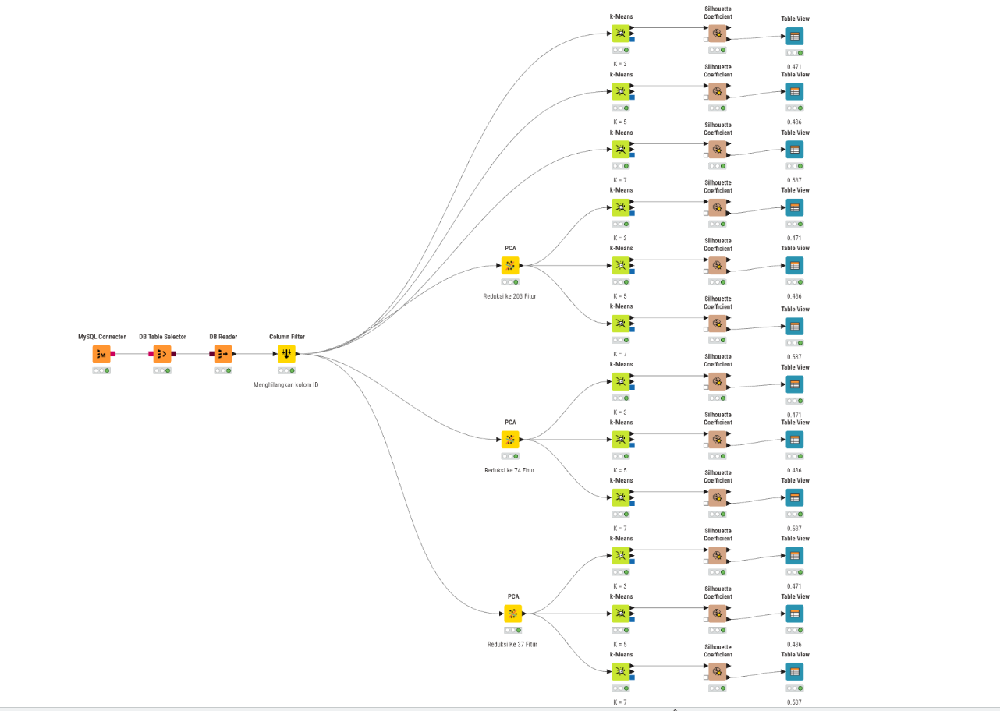

---
jupytext:
  formats: md:myst
  text_representation:
    extension: .md
    format_name: myst
    format_version: 0.13
    jupytext_version: 1.11.5
kernelspec:
  display_name: Python 3
  language: python
  name: python3
---


# K-Means Clustering (Polynomial)



## Dokumentasi Workflow (KNIME)

Workflow di atas merupakan rancangan proses klasterisasi menggunakan algoritma K-Means yang membandingkan empat skenario utama berdasarkan pengolahan data **polynomial**: **tanpa reduksi dimensi**, dan **dengan reduksi dimensi (PCA)** menjadi 203 fitur, 74 fitur, dan 37 fitur. Masing-masing skenario diuji dengan jumlah klaster (k) sebanyak 3, 5, dan 7.

Berikut adalah penjelasan fungsi untuk setiap node yang digunakan:

1. **MySQL Connector**
   Berfungsi untuk membangun koneksi dari KNIME ke server database MySQL menggunakan kredensial (host, port, database, username, password) yang sesuai.

2. **DB Table Selector**
   Menyeleksi atau memilih tabel spesifik di dalam database MySQL yang berisi data mentah polinomial.

3. **DB Reader**
   Mengeksekusi query dari DB Table Selector dan menarik (import) data mentah tersebut dari database ke dalam memori/environment KNIME agar dapat diproses pada node-node selanjutnya.
   
4. **Column Filter**
   Menyeleksi fitur-fitur yang akan digunakan dalam pemodelan. Pada workflow ini, digunakan secara spesifik untuk **menghilangkan kolom ID** karena tidak memiliki nilai analitik untuk proses klasterisasi.

5. **PCA (Principal Component Analysis)**
   Teknik reduksi dimensi yang digunakan untuk menyederhanakan kompleksitas data berdimensi tinggi. Karena penggunaan fitur polynomial akan melipatgandakan jumlah kolom, PCA sangat krusial untuk mengatasi *curse of dimensionality*. Pada workflow ini, PCA dijalankan dalam tiga skenario reduksi:
   - Reduksi ke **203 Fitur**
   - Reduksi ke **74 Fitur**
   - Reduksi ke **37 Fitur**
   
   Tujuannya adalah mencari keseimbangan antara efisiensi komputasi dan retensi informasi (variansi) dari data asli.

6. **k-Means**
   Algoritma inti yang bertugas mengelompokkan data. Pada workflow ini, K-Means dijalankan untuk keempat variasi input data (tanpa PCA, PCA 203, PCA 74, PCA 37) dan masing-masing diuji pembentukan **k = 3, 5, dan 7 klaster**.

7. **Silhouette Coefficient**
   Metrik evaluasi yang digunakan untuk mengukur seberapa baik setiap titik data dikelompokkan ke dalam klasternya sendiri dibandingkan dengan klaster lain.

8. **Table View**
   Node visualisasi yang menampilkan nilai Silhouette Coefficient dalam format tabel interaktif. Berdasarkan gambar, rata-rata *Silhouette Coefficient* dicatatkan secara langsung di atas node Table View untuk memudahkan observasi.

---

## Hasil Evaluasi per Skenario

Pada bagian ini, evaluasi pembentukan klaster diukur menggunakan rata-rata *Silhouette Coefficient* pada masing-masing bereksperimen. Menariknya, hasil yang diperoleh sangat konsisten di setiap variasi PCA maupun tanpa PCA:

### 1. Tanpa Reduksi Dimensi (PCA)

**A. Klastering 3 Kelas (k = 3)**
- **Silhouette Coefficient**: 0.471

*Tabel Silhouette Coefficient:*
```{image} ../../img/polutan-baron/polynomial/tabel-3-nopca.png
:alt: Tabel Silhouette Coefficient k=3 tanpa PCA
:width: 100%
:align: center
:class: mabot-gambar
```

*Visualisasi Scatter Plot:*
```{image} ../../img/polutan-baron/polynomial/sct-3-nopca.png
:alt: Scatter Plot k=3 tanpa PCA
:width: 100%
:align: center
:class: mabot-gambar
```

**B. Klastering 5 Kelas (k = 5)**
- **Silhouette Coefficient**: 0.486

*Tabel Silhouette Coefficient:*
```{image} ../../img/polutan-baron/polynomial/tabel-5-nopca.png
:alt: Tabel Silhouette Coefficient k=5 tanpa PCA
:width: 100%
:align: center
:class: mabot-gambar
```

*Visualisasi Scatter Plot:*
```{image} ../../img/polutan-baron/polynomial/sct-5-nopca.png
:alt: Scatter Plot k=5 tanpa PCA
:width: 100%
:align: center
:class: mabot-gambar
```

**C. Klastering 7 Kelas (k = 7)**
- **Silhouette Coefficient**: 0.537

*Tabel Silhouette Coefficient:*
```{image} ../../img/polutan-baron/polynomial/tabel-7-nopca.png
:alt: Tabel Silhouette Coefficient k=7 tanpa PCA
:width: 100%
:align: center
:class: mabot-gambar
```

*Visualisasi Scatter Plot:*
```{image} ../../img/polutan-baron/polynomial/sct-7-nopca.png
:alt: Scatter Plot k=7 tanpa PCA
:width: 100%
:align: center
:class: mabot-gambar
```

### 2. Reduksi Dimensi dengan PCA (203 Fitur)

**A. Klastering 3 Kelas (k = 3)**
- **Silhouette Coefficient**: 0.471

*Tabel Silhouette Coefficient:*
```{image} ../../img/polutan-baron/polynomial/tabel-3-pca203.png
:alt: Tabel Silhouette Coefficient k=3 PCA 203
:width: 100%
:align: center
:class: mabot-gambar
```

*Visualisasi Scatter Plot:*
```{image} ../../img/polutan-baron/polynomial/sct-3-pca203.png
:alt: Scatter Plot k=3 PCA 203
:width: 100%
:align: center
:class: mabot-gambar
```

**B. Klastering 5 Kelas (k = 5)**
- **Silhouette Coefficient**: 0.486

*Tabel Silhouette Coefficient:*
```{image} ../../img/polutan-baron/polynomial/tabel-5-pca203.png
:alt: Tabel Silhouette Coefficient k=5 PCA 203
:width: 100%
:align: center
:class: mabot-gambar
```

*Visualisasi Scatter Plot:*
```{image} ../../img/polutan-baron/polynomial/sct-5-pca203.png
:alt: Scatter Plot k=5 PCA 203
:width: 100%
:align: center
:class: mabot-gambar
```

**C. Klastering 7 Kelas (k = 7)**
- **Silhouette Coefficient**: 0.537

*Tabel Silhouette Coefficient:*
```{image} ../../img/polutan-baron/polynomial/tabel-7-pca203.png
:alt: Tabel Silhouette Coefficient k=7 PCA 203
:width: 100%
:align: center
:class: mabot-gambar
```

*Visualisasi Scatter Plot:*
```{image} ../../img/polutan-baron/polynomial/sct-7-pca203.png
:alt: Scatter Plot k=7 PCA 203
:width: 100%
:align: center
:class: mabot-gambar
```

### 3. Reduksi Dimensi dengan PCA (74 Fitur)

**A. Klastering 3 Kelas (k = 3)**
- **Silhouette Coefficient**: 0.471

*Tabel Silhouette Coefficient:*
```{image} ../../img/polutan-baron/polynomial/tabel-3-pca74.png
:alt: Tabel Silhouette Coefficient k=3 PCA 74
:width: 100%
:align: center
:class: mabot-gambar
```

*Visualisasi Scatter Plot:*
```{image} ../../img/polutan-baron/polynomial/sct-3-pca74.png
:alt: Scatter Plot k=3 PCA 74
:width: 100%
:align: center
:class: mabot-gambar
```

**B. Klastering 5 Kelas (k = 5)**
- **Silhouette Coefficient**: 0.486

*Tabel Silhouette Coefficient:*
```{image} ../../img/polutan-baron/polynomial/tabel-5-pca74.png
:alt: Tabel Silhouette Coefficient k=5 PCA 74
:width: 100%
:align: center
:class: mabot-gambar
```

*Visualisasi Scatter Plot:*
```{image} ../../img/polutan-baron/polynomial/sct-5-pca74.png
:alt: Scatter Plot k=5 PCA 74
:width: 100%
:align: center
:class: mabot-gambar
```

**C. Klastering 7 Kelas (k = 7)**
- **Silhouette Coefficient**: 0.537

*Tabel Silhouette Coefficient:*
```{image} ../../img/polutan-baron/polynomial/tabel-7-pca74.png
:alt: Tabel Silhouette Coefficient k=7 PCA 74
:width: 100%
:align: center
:class: mabot-gambar
```

*Visualisasi Scatter Plot:*
```{image} ../../img/polutan-baron/polynomial/sct-7-pca74.png
:alt: Scatter Plot k=7 PCA 74
:width: 100%
:align: center
:class: mabot-gambar
```

### 4. Reduksi Dimensi dengan PCA (37 Fitur)

**A. Klastering 3 Kelas (k = 3)**
- **Silhouette Coefficient**: 0.471

*Tabel Silhouette Coefficient:*
```{image} ../../img/polutan-baron/polynomial/tabel-3-pca37.png
:alt: Tabel Silhouette Coefficient k=3 PCA 37
:width: 100%
:align: center
:class: mabot-gambar
```

*Visualisasi Scatter Plot:*
```{image} ../../img/polutan-baron/polynomial/sct-3-pca37.png
:alt: Scatter Plot k=3 PCA 37
:width: 100%
:align: center
:class: mabot-gambar
```

**B. Klastering 5 Kelas (k = 5)**
- **Silhouette Coefficient**: 0.486

*Tabel Silhouette Coefficient:*
```{image} ../../img/polutan-baron/polynomial/tabel-5-pca37.png
:alt: Tabel Silhouette Coefficient k=5 PCA 37
:width: 100%
:align: center
:class: mabot-gambar
```

*Visualisasi Scatter Plot:*
```{image} ../../img/polutan-baron/polynomial/sct-5-pca37.png
:alt: Scatter Plot k=5 PCA 37
:width: 100%
:align: center
:class: mabot-gambar
```

**C. Klastering 7 Kelas (k = 7)**
- **Silhouette Coefficient**: 0.537

*Tabel Silhouette Coefficient:*
```{image} ../../img/polutan-baron/polynomial/tabel-7-pca37.png
:alt: Tabel Silhouette Coefficient k=7 PCA 37
:width: 100%
:align: center
:class: mabot-gambar
```

*Visualisasi Scatter Plot:*
```{image} ../../img/polutan-baron/polynomial/sct-7-pca37.png
:alt: Scatter Plot k=7 PCA 37
:width: 100%
:align: center
:class: mabot-gambar
```

---

## Kesimpulan

Berdasarkan rancangan eksperimen klasterisasi K-Means dengan data polynomial di atas, dapat ditarik beberapa kesimpulan utama:

1. **Jumlah Klaster Optimal (k=7):** Pembagian data menjadi 7 klaster secara konsisten memberikan nilai rata-rata *Silhouette Coefficient* tertinggi yaitu **0.537**, mengungguli pembagian 3 klaster (0.471) dan 5 klaster (0.486). Hal ini menandakan bahwa data memiliki struktur natural yang lebih cocok dipartisi menjadi 7 kelompok.
2. **Efektivitas PCA yang Ekstrem:** Penggunaan PCA untuk mereduksi dimensi hingga ke 37 fitur (dari total fitur polynomial awal) **sama sekali tidak mengubah nilai Silhouette Coefficient**. Nilai yang didapat identik dengan penggunaan data asli (tanpa PCA). Ini membuktikan bahwa 37 komponen utama sudah sangat cukup merepresentasikan variansi penting pada data, sehingga kita bisa menghemat resource komputasi secara signifikan tanpa mengorbankan kualitas klasterisasi.