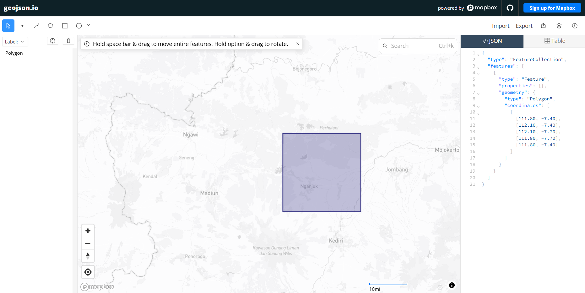
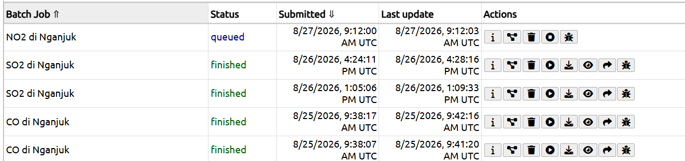

---
jupytext:
  formats: md:myst
  text_representation:
    extension: .md
    format_name: myst
    format_version: 0.13
    jupytext_version: 1.11.5
kernelspec:
  display_name: Python 3
  language: python
  name: python3
---

# Data Understanding
## Collecting Data
Langkah pertama dalam proyek ini adalah mengumpulkan data polutan udara (seperti NO₂, CO, dan SO₂) yang bertipe deret waktu (_Time Series_). Dataset ini diambil dari platform satelit [Copernicus Data Space Ecosystem](https://dataspace.copernicus.eu/).

Buat akun terlebih dahulu di website Copernicus agar bisa melakukan crawling data menggunakan library openEO.

## Install Library

Untuk melakukan proses crawling data, kita membutuhkan pustaka Python pendukung yaitu `openeo` untuk berkomunikasi dengan API Copernicus, dan `netCDF4` untuk membaca format data cuaca spasial (`.nc`).

```bash
pip install openeo
pip install netCDF4
```
## Data Collection
### Autentikasi dan Pengambilan Data

Skrip di bawah ini melakukan proses autentikasi untuk menghubungkan sistem lokal kita dengan server Copernicus menggunakan _device code flow_.

```python
import openeo

connection = openeo.connect("openeo.dataspace.copernicus.eu").authenticate_oidc()
```

Saat menjalankan baris di atas, akan muncul permintaan autentikasi:

```
Visit (link authentikasi) 📋 to authenticate.
✅ Authorized successfully
Authenticated using device code flow.
```

Klik link autentikasi lalu login menggunakan akun Copernicus.

### Definisi Area dan Pengambilan Data NO₂, CO dan SO₂ dari geojson

Setelah berhasil masuk, langkah selanjutnya adalah menentukan wilayah spesifik. Titik koordinat batas wilayah Nganjuk (Poligon) didapatkan menggunakan alat bantu pemetaan [geojson.io](https://geojson.io) dengan menggambar kotak di atas wilayah yang diinginkan kemudian menyalin koordinatnya.



Koordinat yang didapatkan dimasukkan ke dalam variabel `aoi` (Area of Interest). Satelit Sentinel-5P kemudian diminta untuk mengambil data polutan berdasarkan _bounding box_ wilayah tersebut dengan menyesuaikan variabel `s5post` atribut `bands`. 

Karena satelit mungkin merekam area yang sama beberapa kali, dilakukan **agregasi temporal harian** agar hanya terdapat rata-rata satu data per hari. Dilanjutkan dengan **agregasi spasial** agar seluruh _grid_ pada wilayah Nganjuk dirata-rata menjadi satu nilai tunggal.

```python
aoi = {
    "type": "Polygon",
    # Paste koordinat yang didapat 
    "coordinates": [
        [
            [111.80, -7.40],
            [112.10, -7.40],
            [112.10, -7.70],
            [111.80, -7.70],
            [111.80, -7.40],
        ]
    ]
}

s5post = connection.load_collection(
    "SENTINEL_5P_L2",
    temporal_extent=["2023-10-01", "2026-06-01"],
    spatial_extent={
        "west": 111.80,
        "south": -7.70,
        "east": 112.10,
        "north": -7.40
    },
    # Disesuaikan dengan data yang dibutuhkan
    bands=["NO2"],
)

# Agregasi harian agar tidak ada lebih dari satu data per hari
s5p_no2_daily = s5post.aggregate_temporal_period(reducer="mean", period="day")

# Agregasi spasial untuk menghasilkan rata-rata time series per AOI
s5p_no2_aoi = s5p_no2_daily.aggregate_spatial(reducer="mean", geometries=aoi)
```
### Eksekusi Job dan Download

Proses agregasi data spasial ini membutuhkan waktu sehingga dikirim sebagai "_Batch Job_".

```python
job = s5post.execute_batch(title="NO2 in Nganjuk", outputfile="NO2DiNganjuk.nc")
```
Tunggu proses selesai. Status dan progres eksekusi bisa dipantau di [openEO editor](https://editor.openeo.org/?server=https%3A%2F%2Fopeneo.dataspace.copernicus.eu%2Fopeneo%2F1.2). Setelah diproses oleh server, output akan otomatis diunduh berupa file NetCDF **`NO2DiNganjuk.nc`**.



```
0:00:00 Job 'j-2608250945264132925ebef4140e0037': send 'start'
0:00:03 Job 'j-2608250945264132925ebef4140e0037': queued (progress 0%)
0:00:08 Job 'j-2608250945264132925ebef4140e0037': queued (progress 0%)
0:00:15 Job 'j-2608250945264132925ebef4140e0037': queued (progress 0%)
0:00:23 Job 'j-2608250945264132925ebef4140e0037': queued (progress 0%)
0:00:33 Job 'j-2608250945264132925ebef4140e0037': queued (progress 0%)
0:00:46 Job 'j-2608250945264132925ebef4140e0037': running (progress N/A)
0:01:02 Job 'j-2608250945264132925ebef4140e0037': running (progress N/A)
0:01:21 Job 'j-2608250945264132925ebef4140e0037': running (progress N/A)
0:01:45 Job 'j-2608250945264132925ebef4140e0037': running (progress N/A)
0:02:16 Job 'j-2608250945264132925ebef4140e0037': running (progress N/A)
0:02:53 Job 'j-2608250945264132925ebef4140e0037': running (progress N/A)
0:03:40 Job 'j-2608250945264132925ebef4140e0037': finished (progress 100%)
```

### Simpan Data dalam Bentuk CSV
Format mentah NetCDF (`.nc`) yang kita dapatkan masih berbentuk matriks spasial tiga dimensi yang kurang ramah untuk dianalisis secara tabular. Oleh karena itu, kita membedah file tersebut menggunakan Python untuk di-convert ke dalam `.csv`:
1. Data waktu (_Time_) dikonversi menjadi format tanggal yang bisa dibaca.
2. Untuk mengatasi potensi adanya nilai kosong (_null_) di _grid_ spasial tertentu, digunakan metode **Interpolasi Linier**.
3. Setelah data dibersihkan, seluruh _grid_ Nganjuk dirata-rata untuk setiap harinya lalu disimpan ke dalam format tabel (CSV) agar mudah diproses.

```python
import numpy as np
import pandas as pd
import netCDF4

file_path = "NO2DiNganjuk.nc"
ds = netCDF4.Dataset(file_path)
# Ambil NO2
no2 = ds.variables["NO2"][:]

# Ambil Time
time = ds.variables["t"][:]

# Konversi waktu ke format tanggal
try:
    time_units = ds.variables["t"].units
    dates = netCDF4.num2date(time, units=time_units)
except Exception:
    dates = time  # fallback jika tidak ada units

no2_filled = np.zeros_like(no2)
no2_filled = no2_filled.filled(0)

# Loop tiap grid (y, x)
for i in range(no2.shape[1]):     # 9 baris
    for j in range(no2.shape[2]): # 8 kolom
        series = pd.Series(no2[:, i, j])
        no2_filled[:, i, j] = series.interpolate(
            method='linear', limit_direction='both'
        ).to_numpy()
        
new_dates = []
new_no2 = []

for i in range(len(dates)):
    new_date = dates[i].strftime('%Y-%m-%d')
    new_dates.append(new_date)
    new_no2.append(np.mean(no2_filled[i]))

df = pd.DataFrame({
    "date": new_dates,
    "NO2": new_no2
})

# Simpan ke CSV
df.to_csv("NO2_Nganjuk_timeseries.csv", index=False)
```

### Hasil CSV
Pada tahap terakhir, kita memuat file CSV (CO, SO₂, dan NO₂) yang telah dirapikan menggunakan pustaka Pandas. Data ini sekarang sudah terstruktur sebagai dataset _Time Series_ dan siap digunakan untuk analisis lanjutan. Berikut adalah cuplikan data tersebut:

1. CO

```{code-cell}
:tags: [hide-input]
import pandas as pd
import numpy as np
df = pd.read_csv("../../data/polutan/CO_Nganjuk_timeseries.csv")
df.head(5)
```

2. SO2

```{code-cell}
:tags: [hide-input]
df = pd.read_csv("../../data/polutan/SO2_Nganjuk_timeseries.csv")
df.head(5)
```

3. NO 2

```{code-cell}
:tags: [hide-input]
df = pd.read_csv("../../data/polutan/NO2_Nganjuk_timeseries.csv")
df.head(5)
```
